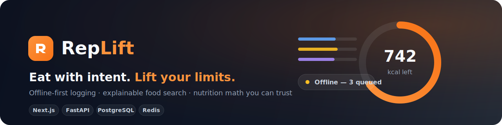

<p align="center">
  
</p>

<p align="center">
  <a href="https://anakintano.github.io/RepLift/"><b>▶ Live demo</b></a> ·
  <a href="docs/architecture.md">Architecture & ADRs</a> ·
  <a href="docs/design-system.md">Design system</a> ·
  <a href="docs/brand.md">Brand</a> ·
  <a href="docs/slides/replift-deck.html">Engineering deck</a>
</p>

---

RepLift is a production-grade nutrition & fitness SaaS built as a graduate SWE portfolio project. The product is real; the point is the engineering underneath it:

- **Offline-first sync engine** — IndexedDB outbox, queued mutations with idempotency keys, optimistic UI, revision-based conflict detection with user-facing resolution. *The same request twice creates exactly one record — proven at the database, not claimed.*
- **Explainable food search** — Postgres FTS + pg_trgm trigram fuzzy matching; ranking = text score + popularity boost + personal-history boost, with the breakdown returned on every result. `"chiken brest"` finds chicken breast.
- **Deterministic nutrition engine** — one calculation core mirrored in TypeScript and Python, kept in lock-step by shared test vectors (serving conversion, recipe portioning, half-up rounding, timezone-correct diary days).
- **Observable background jobs** — ARQ on Redis: data exports, two-phase account deletion, weekly-report fan-out, search-popularity refresh; exponential-backoff retries with a `job_runs` history table as the dead-letter record.
- **Guardrailed AI** — natural-language logging ("2 eggs and toast") via Groq/Llama 3.3: the LLM only extracts structure, items resolve through the same search as manual queries, the user confirms everything, and outages degrade gracefully. The app is fully functional with AI off.

**73 automated tests**: 54 Vitest (nutrition engine, dates/timezones, search ranking, full outbox + conflict lifecycle on fake-indexeddb) + 19 pytest (sync idempotency & conflicts, authz/ownership, auth flow with refresh rotation, shared nutrition vectors) — run in CI on every push.

## Live demo

**https://anakintano.github.io/RepLift/** — log in with `demo@replift.app / demo1234`.

The demo runs the frontend against its **in-browser mock backend** (a faithful simulation with the same idempotency and revision semantics — that's what made the frontend testable before the backend existed). Everything works: offline logging, sync, conflicts, search, reports. Open the flask button (bottom-right) to force offline, inject failures, or stage a two-device conflict.

## Full stack, locally

```bash
docker compose up -d                       # PostgreSQL 16 + Redis 7

cd backend
python -m venv .venv && .venv/Scripts/activate   # Windows (source .venv/bin/activate on unix)
pip install -r requirements.txt
cp .env.example .env                       # add GROQ_API_KEY for AI features (optional)
python -m app.seed                         # tables, indexes, 107-food catalog, demo account
python -m uvicorn app.main:app --port 8000            # API  → http://localhost:8000/docs
python -m arq app.jobs.worker.WorkerSettings           # background worker (2nd terminal)

cd ../frontend
npm install
echo "NEXT_PUBLIC_API_MODE=http" > .env.local
npm run dev                                # http://localhost:3000
```

Tests: `npm test` (frontend) · `python -m pytest` (backend, needs the containers).
Load-test the search: `python -m app.seed --synthetic 10000`.

## Stack

| | |
|---|---|
| Frontend | Next.js 16 · TypeScript · Tailwind v4 · shadcn/ui · TanStack Query · Dexie (IndexedDB) · Recharts |
| Backend | FastAPI · SQLAlchemy 2 (async) · Pydantic v2 · argon2 + JWT w/ rotating refresh cookies |
| Data | PostgreSQL 16 (FTS + pg_trgm, JSONB) · Redis 7 |
| Jobs | ARQ (retries, cron, idempotent job ids) |
| AI | Groq · Llama 3.3 70B (parse-only boundary) |
| Ops | docker-compose · structured JSON logs w/ request ids · `/health` · Prometheus-format `/metrics` · GitHub Actions CI |

## Repo layout

```
frontend/   Next.js app (mock + http data layers behind one ApiClient contract)
backend/    FastAPI app: routers/ domain/ jobs/ + pytest suite
docs/       architecture + ADRs, design system, brand, slide deck
assets/     brand assets
```

## What's deliberately out of scope

Payments, social features, wearable integrations (architecture supports them — see ADRs), email delivery (stubbed), and mobile apps. Nutrition figures are estimates, not medical advice.
